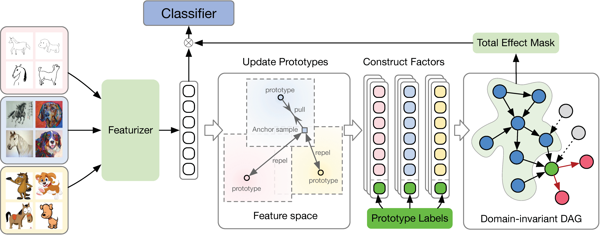

# iDAG: Towards Invariant Causal Discovery for Domain Generalization

PyTorch implementation of iDAG.



## Preparation

### Dependencies

```sh
pip install -r requirements.txt
```

### Datasets

```sh
python -m domainbed.scripts.download --data_dir=/my/datasets/path
```

### Environments

Environment details used for our study.

```
Python: 3.10.4
PyTorch: 1.11.0
Torchvision: 0.12.0
CUDA: 10.2
CUDNN: 7605
NumPy: 1.23.1
PIL: 9.2.0
```

## How to Run

`train_all.py` script conducts multiple leave-one-out cross-validations for all target domain.

```sh
python train_all.py exp_name --dataset PACS --data_dir /my/datasets/path
```

Experiment results are reported as a table. In the table, the row `SWAD` indicates out-of-domain accuracy from SWAD.
The row `SWAD (inD)` indicates in-domain validation accuracy.

Example results:
```
+------------+--------------+---------+---------+---------+---------+
| Selection  | art_painting | cartoon |  photo  |  sketch |   Avg.  |
+------------+--------------+---------+---------+---------+---------+
|   oracle   |   87.309%    | 85.181% | 96.781% | 83.174% | 88.112% |
|    iid     |   84.137%    | 78.891% | 96.108% | 77.449% | 84.146% |
|    last    |   82.428%    | 76.226% | 94.611% | 78.690% | 82.989% |
| last (inD) |   96.548%    | 95.338% | 95.523% | 95.715% | 95.781% |
| iid (inD)  |   97.301%    | 96.736% | 96.787% | 97.098% | 96.980% |
|    SWAD    |   90.811%    | 84.488% | 97.979% | 82.761% | 89.009% |
| SWAD (inD) |   98.054%    | 97.561% | 97.425% | 97.992% | 97.758% |
+------------+--------------+---------+---------+---------+---------+
```
In this example, the DG performance of SWAD for PACS dataset is 89.009%.


### Reproduce the results of the paper

We provide the instructions to reproduce the main results of the paper in Appendix.
The default hyper-parameters are not optimal for all subtasks, so a command for launching the sweep is also provided.
Note that the difference in a detailed environment or uncontrolled randomness may bring a little different result from the paper.


- CMNIST

```
python train_all.py CMNIST0 \
  --algorithm iDAGCMNIST \
  --data_dir /my/datasets/path \
  --dataset ColoredMNIST \
  --holdout_fraction 0.2 \
  --output_dir train_output/cmnist \
  --seed 0 \
  --test_envs 0 \
  --trial_seed 0
```

- PACS

```
python train_all.py PACS0 \
  --algorithm iDAG \
  --data_dir /my/datasets/path \
  --dataset PACS \
  --holdout_fraction 0.2 \
  --output_dir train_output/pacs \
  --seed 0 \
  --test_envs 2 \
  --trial_seed 0 \
  --hparams {"hidden_size": 256, "out_dim": 256, "checkpoint_freq": 200, "steps": 5000}
```

- OfficeHome

```
python train_all.py OH0 \
  --algorithm iDAG \
  --data_dir /my/datasets/path \
  --dataset OfficeHome \
  --holdout_fraction 0.2 \
  --output_dir train_output/officehome \
  --seed 0 \
  --test_envs 2 \
  --trial_seed 0 \
  --hparams {"hidden_size": 512, "out_dim": 512, "checkpoint_freq": 200, "steps": 5000}
```

- TerraIncognita

```
python train_all.py TR0 \
  --algorithm iDAG \
  --data_dir /my/datasets/path \
  --dataset TerraIncognita \
  --holdout_fraction 0.2 \
  --output_dir train_output/terraincognita \
  --seed 0 \
  --test_envs 2 \
  --trial_seed 0 \
  --hparams {"hidden_size": 512, "out_dim": 512, "checkpoint_freq": 200, "steps": 5000}
```

- DomainNet

```
python train_all.py DN0 \
  --algorithm iDAG \
  --data_dir /my/datasets/path \
  --dataset TerraIncognita \
  --holdout_fraction 0.2 \
  --output_dir train_output/domainet \
  --seed 0 \
  --test_envs 2 \
  --trial_seed 0 \
  --hparams {"hidden_size": 1024, "out_dim": 1024, "checkpoint_freq": 500, "steps": 15000}
```


- Launch Sweep

```
python -m domainbed.scripts.sweep launch \
       --data_dir=/my/datasets/path \
       --output_dir=train_output/sweep/officehome \
       --command_launcher multi_available_gpu \
       --algorithms iDAG \
       --mem_usage 12GiB \
       --num_parallel 8 \
       --datasets OfficeHome \
       --single_test_envs \
       --n_hparams 20 \
       --n_trials 3 \
       --hparams '{"hidden_size": 512, "out_dim": 512, "checkpoint_freq": 300, "steps": 3000}'
```
